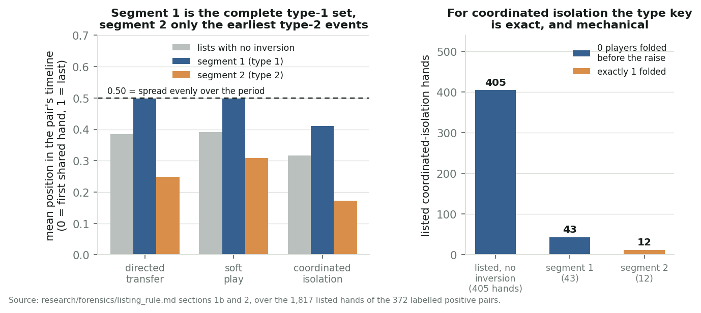
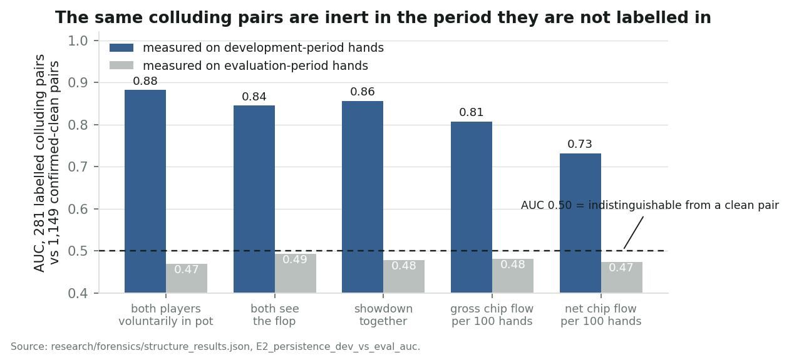
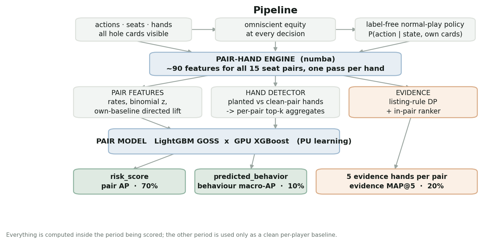
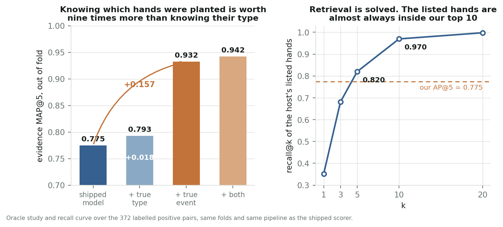

<h1 align="center">Poker Collusion Detection</h1>

<p align="center">
  <b>Finding coordinated players in 2,000,000 hands of online poker, and proving it with evidence.</b><br>
  8th of 370 teams in Kaggle's <i>Detect Suspicious Value Transfers in Poker</i> · private score <b>0.92817</b>
</p>

<p align="center">
  
  
  
  
  
</p>

<p align="center">
  <a href="https://www.kaggle.com/code/erickeller2/8th-place-detecting-coordinated-poker-pairs"><b>Read the solution write-up on Kaggle</b></a>
</p>

---

Two players at a table quietly move chips to each other. One folds the winning hand; the other raises to clear
the field. **Detect it from the action log alone, rank 112,540 candidate pairs by risk, name the behaviour, and
hand a human reviewer the five hands that prove it.**

This repository is the full, reproducible solution: a numba pair-hand feature engine, a label-free model of
normal poker, positive-unlabeled learning over 372 labelled pairs, and a dynamic program that reconstructs the
rule the organisers used to build their evidence lists.

<p align="center">
  
</p>

## Results

| component | weight | score | what it measures |
|---|---:|---:|---|
| pair average precision | 70% | **0.9807** | ranking 112,540 pairs by collusion risk |
| evidence MAP@5 | 20% | **0.7218** | retrieving the planted hands for each true positive |
| behaviour macro-AP | 10% | **0.9692** | naming the coordination family |
| **final (private)** | | **0.92817** | 8th of 370 |

Every component was measured exactly, not inferred, by submitting copies of one scored file with a single field
blanked. See [`research/WRITEUP.md`](research/WRITEUP.md) for the method and the algebra.

## The two findings that did the work

### 1. Coordination is phase-local

Each table plays 5,000 hands. The first 3,000 carry the labels; the last 2,000 are scored. Take the labelled
colluding pairs and recompute the same statistics in the period they are *not* labelled in, and every signal
collapses to chance. The colluding player sets of the two periods are disjoint.

<p align="center"></p>

So every feature is computed **inside the period being scored**, with the other period used only as a clean
per-player baseline. Public notebooks that mixed the two periods topped out around 0.695.

### 2. The evidence list is a sorting rule, not a ranking

The organisers ask for up to five "evidence" hands per flagged pair. Reading listed hands against
identical-looking unlisted ones showed each list is two chronologically sorted segments concatenated, with
exactly one time inversion in 91 of 91 directed-transfer lists and 11 of 11 coordinated-isolation lists. The rule:

```python
evidence = sorted(EVENTS, key=(event_type, hand_seq))[:5]
```

For coordinated isolation the type key is exact and mechanical: the number of players who folded before the
pair's first preflop raise, holding on all 460 listed hands. For the other two families the type is latent, so it
is learned (AUC 0.972 and 0.945) and the probability that a hand is listed is computed with an exact
Poisson-binomial dynamic program over each pair's hands.

## Pipeline

<p align="center"></p>

Every hole card is visible in this dataset, including folded players, so each decision can be priced exactly:

* **Directed transfer** shows one-way chip flow plus a donor who flat-calls the partner's raise where a
  label-free normal-play policy gives `P(call) < 0.15`. Pair AUC 0.993.
* **Soft play** shows a partner answering the other's aggression passively, with a raise-back in 1.8% of
  planted hands against a far higher rate versus everyone else.
* **Coordinated isolation** shows a preflop raise the population makes under 2% of the time in that exact spot.
  Pair AUC 1.000.

**Directedness beats raw rates.** The strongest features compare a player's behaviour *with this partner* to
*the same player with their other 28 table-mates*, which removes the tilt, weak and loose personas the generator
simulates. Per-player fold rates span 0.42 to 0.79 where the population policy predicts a band of 0.61 to 0.67.

## Reproduce it

```bash
git clone https://github.com/stonesalltheway1/poker-collusion-detection
cd poker-collusion-detection
pip install -r requirements.txt

# the competition data is not redistributable, so download it yourself:
kaggle competitions download -c detect-suspicious-value-transfers-in-poker -p data/raw
unzip -o "data/raw/*.zip" -d data/raw

python src/run_all.py --list   # 49 stages, what each produces and whether it exists
python src/run_all.py          # run them all, skipping anything already built
```

About 10 to 14 hours end to end on an i5-10400F with 32 GB and a GTX 1660S. Set `XGB_DEVICE=cpu` to run without
a GPU. `run_all.py --dry-run` prints the plan without executing.

## What is in here

| path | what |
|---|---|
| [the Kaggle write-up](https://www.kaggle.com/code/erickeller2/8th-place-detecting-coordinated-poker-pairs) | the published solution write-up and case reviews |
| [`research/WRITEUP.md`](research/WRITEUP.md) | the same write-up in the repo, with figures |
| [`notebooks/`](notebooks/) | the exact notebook published to Kaggle |
| [`research/CASE_REVIEWS_SHORT.md`](research/CASE_REVIEWS_SHORT.md) | five worked cases: behaviour, benign alternative, and what would overturn it |
| [`research/CASE_REVIEWS.md`](research/CASE_REVIEWS.md) | the same cases with all 25 hands replayed action by action |
| [`research/forensics/listing_rule.md`](research/forensics/listing_rule.md) | how the evidence-listing rule was derived, in full |
| [`experiments/LEDGER.md`](experiments/LEDGER.md) | every experiment, its CV, its leaderboard delta, and the verdict |
| [`research/CLOSED_LANES.md`](research/CLOSED_LANES.md) | every measured dead end, with the condition that would reopen it |
| [`POSTMORTEM.md`](POSTMORTEM.md) | why this finished 8th and not 1st |
| `src/` | engine, policy, pair models, evidence rankers |
| `scripts/` | forensics, the listing-rule DP, validation views, bootstrap, figures |

## What did not work

Recorded because negative results are the expensive part. Full list with numbers in
[`research/CLOSED_LANES.md`](research/CLOSED_LANES.md).

* **Six attacks on the latent "was this hand planted" bit**, all neutral or negative. Better *detection* makes
  listing MAP worse, because better detectors also fire on planted-but-unlisted hands.
* **65 label-free directed statistics** hunting an undisclosed fourth coordination family, against three null
  models. Documented null.
* **A validation view that deleted the population it was scored on.** A candidate at `P(better) = 1.000`,
  positive in 5 of 5 folds and replicated at a second seed, delivered **−0.00007** on the leaderboard.
* **An unidentified two-parameter fit** that closed the best remaining lane for three days before being caught.

<p align="center"></p>

Retrieval is solved: the listed hands are almost always inside the top 10 candidates. The entire residual is a
binary discrimination over roughly ten hands per pair, and it is genuinely latent.

## Rules and responsible use

Every feature derives from poker activity: actions, amounts, hole cards, board, and hand order within the scored
period. Nothing uses ID formats, file or row ordering, or evaluation-file membership, and no player metadata
reaches any model. The competition data itself is not redistributed here.

The data is synthetic and these are benchmark patterns, not accusations. A high score is a prompt for human
review, never a finding of guilt, which is why every case review ships with a benign alternative and a statement
of what would overturn it.

## Licence

MIT, see [`LICENSE`](LICENSE). The competition data is the organisers' and is not included.
