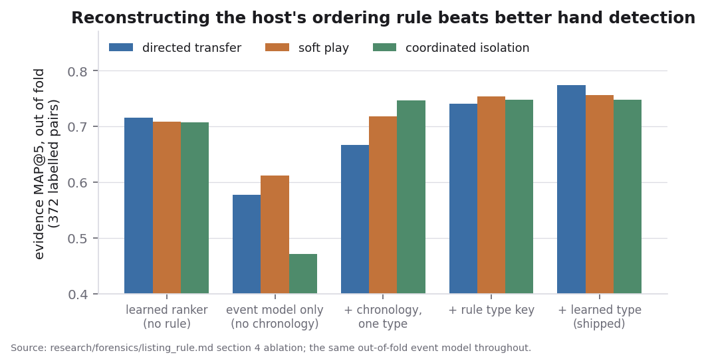
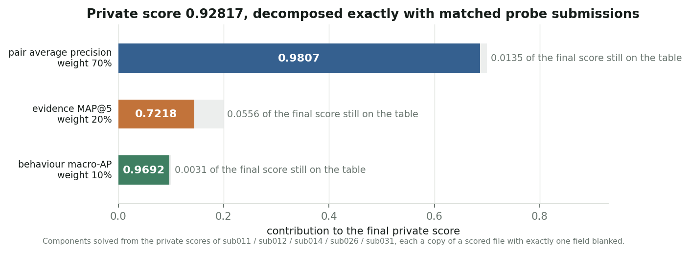
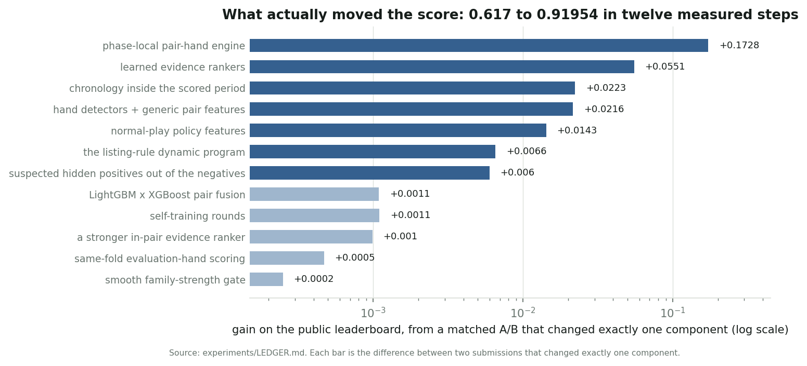

# Detecting coordinated poker pairs: phase-local signatures, and reverse-engineering the evidence list

*Every number is out-of-fold, or a leaderboard reading decomposed with matched probes.
Reproduction: `python src/run_all.py`.*

---

## 1. Two findings did almost all of the work

### (a) Coordination is phase-local

Each table's 5,000 hands split into a development period (hands 0–2999, where the labels live) and an evaluation
period (3000–4999, which is scored). **A labelled colluding pair is active only in the period it is labelled in.**
Measured on the 281 labelled positive pairs sharing ≥38 evaluation hands, against the 1,488 confirmed-clean pairs,
every generic pair statistic collapses to chance when recomputed on the other period:


The colluding player sets of the two periods are disjoint (0 overlap, ≈4.5 expected by chance) and the dev↔eval
Spearman of our pair scores is 0.16. So a pair is scored **only on hands from the period being judged**, the other
period serving as a clean per-player baseline. Every public notebook we read mixes the periods; best public score 0.695.

### (b) The evidence list follows a rule

Evidence MAP@5 is 20% of the score and our weakest component. Reading listed hands against
unlisted look-alikes showed each list is **two chronologically sorted segments concatenated** (exactly one inversion in DT 91/91, CI 11/11, SP 93/96). The rule is

```
evidence = sorted(EVENTS, key=(type, hand_seq))[:5]
```

— every type-1 event of the period in chronological order, then the earliest type-2 events, cut at 5.


Left: segment 1 sits at mean position 0.50 of the pair's timeline, so it is *not* selected by time — it is the
complete type-1 set; segment 2 sits early, so it holds the first few type-2 events. Right: for coordinated
isolation the type key is exact and mechanical — folds before the pair's first preflop raise, 0 → type 1,
1 → type 2 — on all 460 listed CI hands.

For directed transfer, type 1 is "the donor folds to the receiver holding the better made hand" (221/236
segment-1 hands vs 32/213 segment-2); for soft play the same fold-ahead (182/213), type 2 a passive call
(223/232). Both are only partly visible — identical action strings occur in both segments — so we learn them
(out-of-fold AUC 0.972 / 0.945) and compute, by exact Poisson-binomial dynamic programming over each pair's hands,
the probability a hand is listed. Blended 0.7 with a learned in-pair ranker this moved development MAP@5 from 0.711
to 0.775 and the leaderboard evidence component from 0.666 to 0.705.



---

## 2. Pipeline

```
actions/seats/hands ─► omniscient equity ─► label-free normal-play policy P(action | state, cards)
        └─► PAIR-HAND ENGINE (numba): ~90 features × 15 seat pairs, one pass per hand
              ├─ pair features: rates, binomial z, own-baseline directed lift ─┐
              ├─ hand detector: planted vs clean-pair hands ───────────────────┤
              └─ evidence: listing-rule DP + in-pair ranker → top-5 per pair   │
                 PAIR MODEL (LightGBM GOSS × XGBoost, PU) → risk · behaviour ◄─┘
```

**Hand-level signatures.** With every hole card visible each decision is priced exactly. Directed transfer shows
one-way chip flow (100% of planted hands) and a donor flat-calling the partner's raise where the normal-play model
gives P(call) ≤ 0.15 (pair AUC 0.993). Soft play shows a partner answering the other's aggression passively (a
raise-back appears in 1.8% of planted hands). Coordinated isolation shows a preflop raise the population makes
under 2% of the time in that exact spot (pair AUC 1.000).

**Directedness beats raw rates.** The strongest features compare a player's behaviour *with this partner* against
*the same player with their other 28 table-mates* (shrunk log-lift, excess counts, mutual-top flags), which removes
the tilt/weak/loose personas the generator simulates — per-player fold rates span 0.42–0.79 where the population
policy predicts 0.61–0.67.

**PU learning.** Only 372 pairs are labelled positive, and the 1,488 confirmed-clean pairs are indistinguishable
from random unlabelled pairs (AUC 0.494), so no hard-negative machinery is needed. Two self-training steps help —
highly-scored non-listed hands of positive pairs become weak positives (+0.0045, P(better) 0.978), and ≈154
unlabelled pairs carrying full family signatures are promoted (+0.0023). A transductive version using
evaluation-period pseudo-labels clearly hurt (0.944 vs 0.958).

---

## 3. Validation

Five folds **by table**, frozen on day 0 (a player sits at one table, so folds share no players). The unlabelled
pool contains hidden positives, so naive pooled AP *penalises* a model for finding them; we also report a view
excluding a frozen list of model-selected suspects. That view is optimistic by construction, so every change
needed a paired table-bootstrap at P(better) ≥ 0.8 and then a submission changing **exactly one component**.

Probe submissions decompose the score exactly, with one correction that is easy to miss twice: blanking the
behaviour column does not give AP = 0, because the host ranks ties in `pair_id` order, so the probe returns the AP
of a random ranking — *per family*, over ~P/3 positives, not P. That is 0.0018 ± 0.0006 at public size.


*0.91942 = 0.7(0.97445) + 0.2(0.70480) + 0.1(0.96345), measured with three matched probes.*


*Each bar is a matched A/B.*

---

## 4. What limits the score

An oracle decomposition through the same folds prices the two latent bits: the true **type** is worth +0.018 MAP,
the true **event** — was this hand's action actually altered? — **+0.157** (0.775 → 0.932). Evidence retrieval is
limited by *which hands were planted*, not by how they are ordered, and that bit is genuinely latent: a hand counts
only if the colluder's action changed, so look-alikes with the same action string, position and hand strength sit
unlisted *between* listed hands. The best deterministic predicate reproduces a pair's exact list for only 7–25% of
pairs, and six attempts to sharpen the event head were neutral or negative. Retrieval is not the bottleneck:
recall@10 is 0.970, so the residual is selecting 5 of ~10 candidates.

Matched leaderboard points say a development gain arrives on evaluation at a factor of **0.86–0.93**. We had read
that same fit as "14% of evaluation positives belong to an undisclosed fourth mechanism". That reading is wrong.
Two bounds close it. An `other_coordination` pair is a negative for all three disclosed families but a positive
for pair AP, so high-ranked `other_coordination` truth costs ≈0.95 points of behaviour macro-AP per unit: ours is
0.963 against a pair AP of 0.974, where 14% would cost 0.13. And a fourth mechanism hiding *low* in
the ranking is excluded independently — held-out-family validation prices such pairs at AP 0.08, so a pair AP of
0.974 caps their share at 2.8%. High or low, ≤3%. **The pairs we detect are essentially all disclosed-family, and
we route their family essentially correctly.** The mis-served cohort identifies positively as low-exposure soft
play: a statistic calibrated to fire on 0 of the 1,488 clean pairs fires on 183/174,000 development and
193/174,000 evaluation pairs — ratio 1.05, so there is no evaluation-only population.

---

## 5. Negative results worth recording

- **The undisclosed mechanism.** 65 label-free directed statistics (ghosting, best-hand-plays, blind-steal
  agreements, mutual pot building, chip dumps, bet-size signalling, three-player rings) against three nulls:
  documented null, from an instrument that recovers the three known families at 0.30–0.74 recall at zero false
  positives.
- **Evidence selection is at its ceiling given our P(listed).** The planted-event process really is memoryless:
  on 162 complete lists the first four listed hands sit at scaled positions [0.195, 0.400, 0.587, 0.799] against a
  Poisson null of [0.2, 0.4, 0.6, 0.8].
- **The blend needs a calibrated partner, not a better ranker.** Rank-averaging our two in-pair rankers is the best
  standalone ranker (+0.005) and the worst blend member (−0.011).
- Player metadata, seat adjacency, co-presence: AUC 0.48–0.53. A cross-fitted hill-climb over four pair models
  is worse out of fold than fixed equal weights. No external data or pretrained models were used.

---

## 6. Rule compliance and responsible interpretation

Every feature derives from poker activity: actions, amounts, hole cards, board, and hand order within the scored
period. Nothing uses ID format, file or row order, or evaluation-file membership; no metadata reaches any model.

**Disclosure.** The evidence ranker uses chronological order *within the scored period*, because the host's lists
are ordered that way. The ordering key is the hand start timestamp — there are zero tied `(table, timestamp)`
groups across all 2,000,000 hands, so no identifier is ever load-bearing. The listing convention was learned from
the published development evidence: that is the scored task, but also a property of how the lists were built, so
we flag it explicitly.

The data is synthetic; these are benchmark patterns, not accusations. Each of the five case reviews gives the hand,
both players' hole cards, the board, every action, the statistic that fired with its population baseline, a benign
alternative, and the observation that would overturn the reading — typically "if this player shows the same rate
against all 28 other table-mates, the directedness evidence disappears". A high score is a prompt for human
review, not a finding of guilt.
